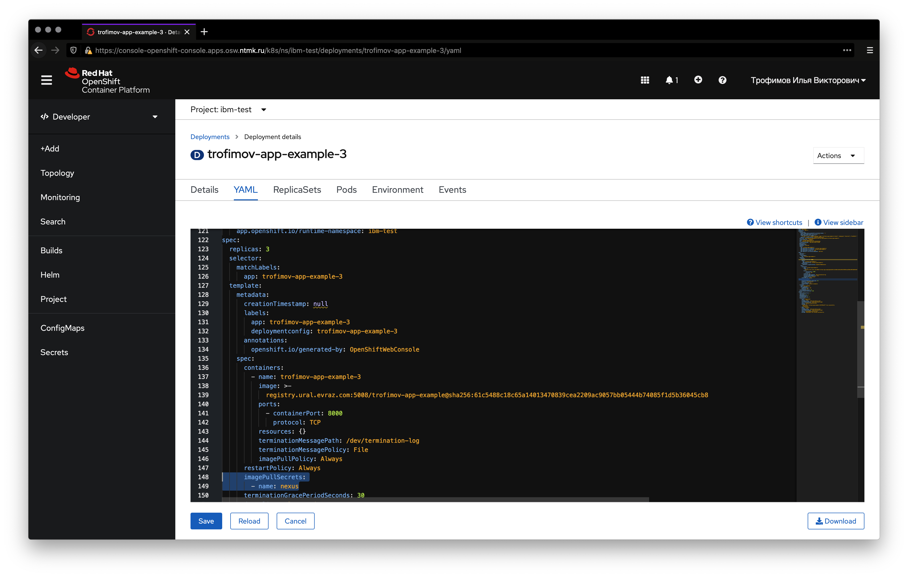

# Лабораторная работа 5

- Web-консоль OpenShift: https://console-openshift-console.apps.osw.ntmk.ru/
- Nexus Registry: https://registry.ural.evraz.com/

## Push приложения в registry

```shell
cd app
```

В случае, если Docker не работает без _sudo_

```shell
sudo groupadd docker
sudo usermod -aG docker $USER
exit
```

Авторизируемся в registry
```shell
docker login registry.ural.evraz.com:5008
```


<details>
  <summary>или через podman</summary>
  
  ```shell
  podman login registry.ural.evraz.com:5008 --tls-verify=false
  ```
  
  в таком случае остальные команды тоже делаем через podman
</details>

Собираем образ и присваиваем ему тэг
```shell
docker build -t registry.ural.evraz.com:5008/ВАША-ФАМИЛИЯ-В-НИЖНЕМ-РЕГИСТРЕ-test-app:1.0.0 .
```

Делаем push во внешний registry
```shell
docker push registry.ural.evraz.com:5008/ВАША-ФАМИЛИЯ-В-НИЖНЕМ-РЕГИСТРЕ-test-app:1.0.0
```


## Деплой приложения

Заходим в OpenShift кластер


При желании, можете делать эти же операции в терминале

```shell
oc login https://api.osw.ntmk.ru:6443 -u ВАШ_ЛОГИН
```

Создадим новый проект:
1) Нажимаем на `Administrator`, переключимся на `Developer`
2) Вверху кликаем на выпадающий список `Project: ...`
3) Нажимаем `Create Project`

Создадим новое приложение:
1) Нажимаем на `+Add`
2) Выбираем `Container Image`
3) Нажимаем `create an Image pull secret`. Заполняем поля, используя те же данные что и для docker login
4) Вводим тот тэг образа, с которым вы делали docker push
5) Нажимаем `Create`


Отредактируем _deployment_ для нашего приложения. Это нужно сделать, чтобы _deployment_ знал какой _secret_ нужно использовать при скачке образа из registry.

1) Нажимаем на `Topology`
2) Выбираем приложение
3) Нажимаем `Actions`
4) Нажимаем `Edit Deployment`
5) Добавляем
```yaml
imagePullSecrets:
  - name: имя того secret, который был создан для registry
```
6) Сохраняем



На этом этапе приложение должно начать деплой и стать доступно через несколько секунд.

1) Нажимаем на `Topology`
2) Выбираем приложение
3) Нажимаем `View Logs`


1) Нажимаем на `Topology`
2) Выбираем приложение
3) Кликаем на ссылку в секции `Routes`


